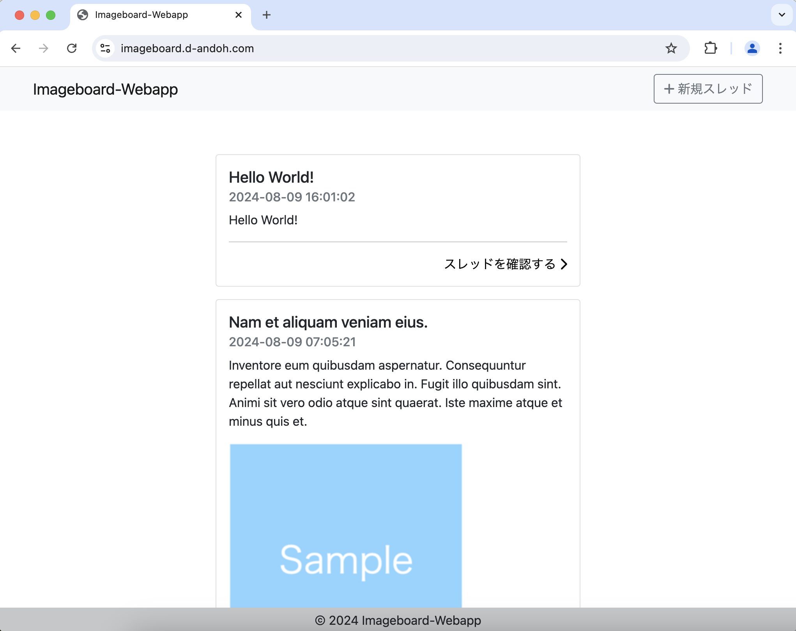
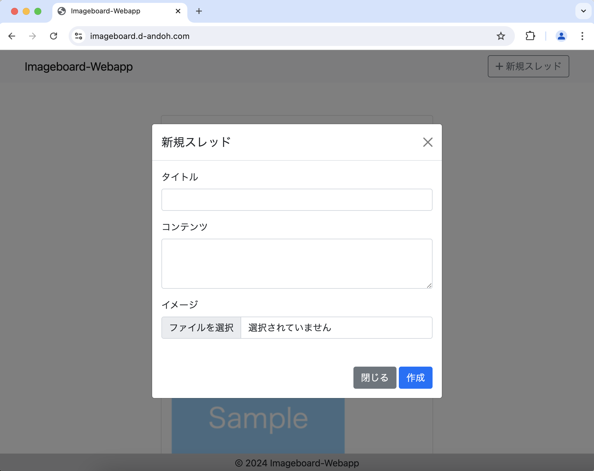
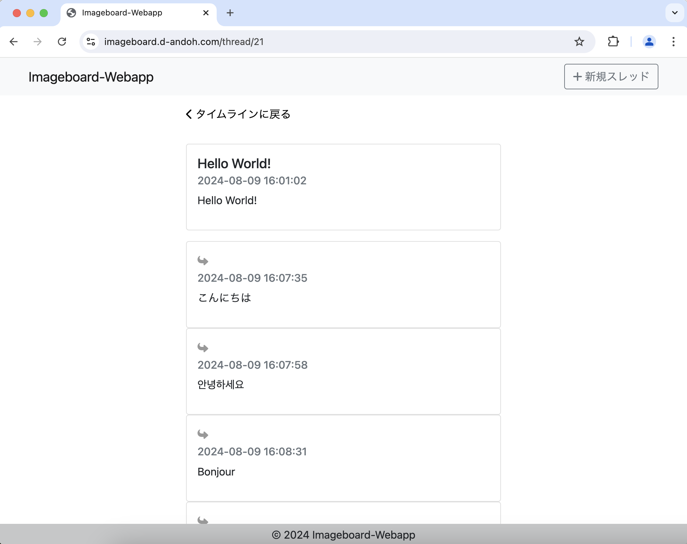
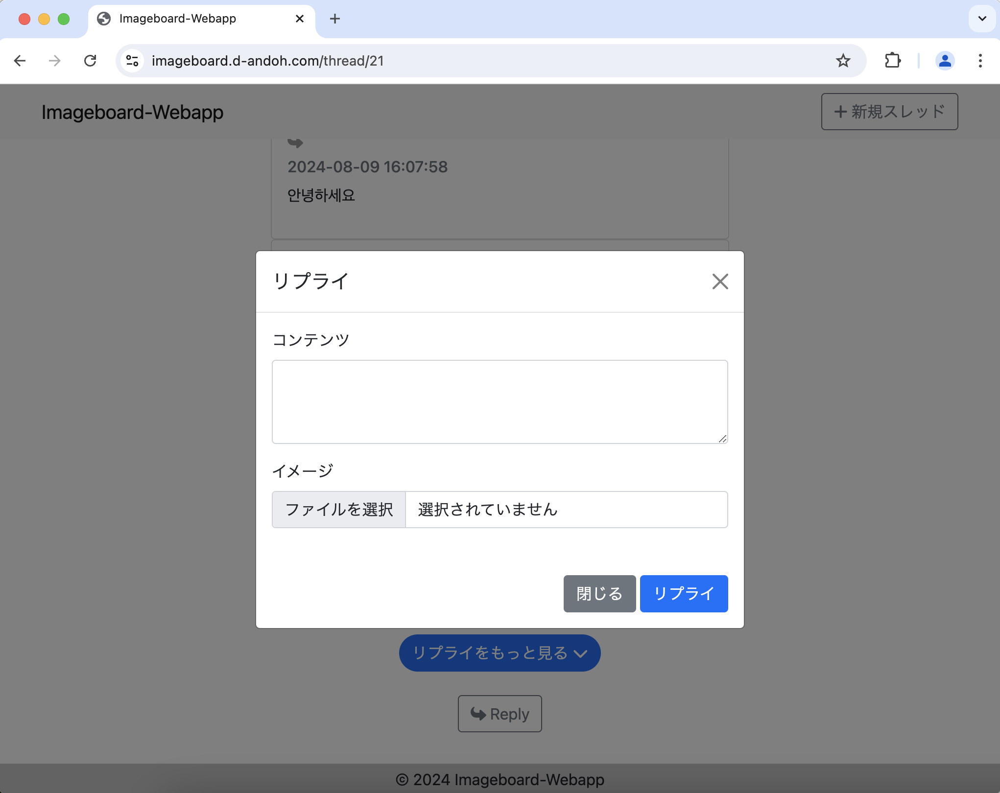
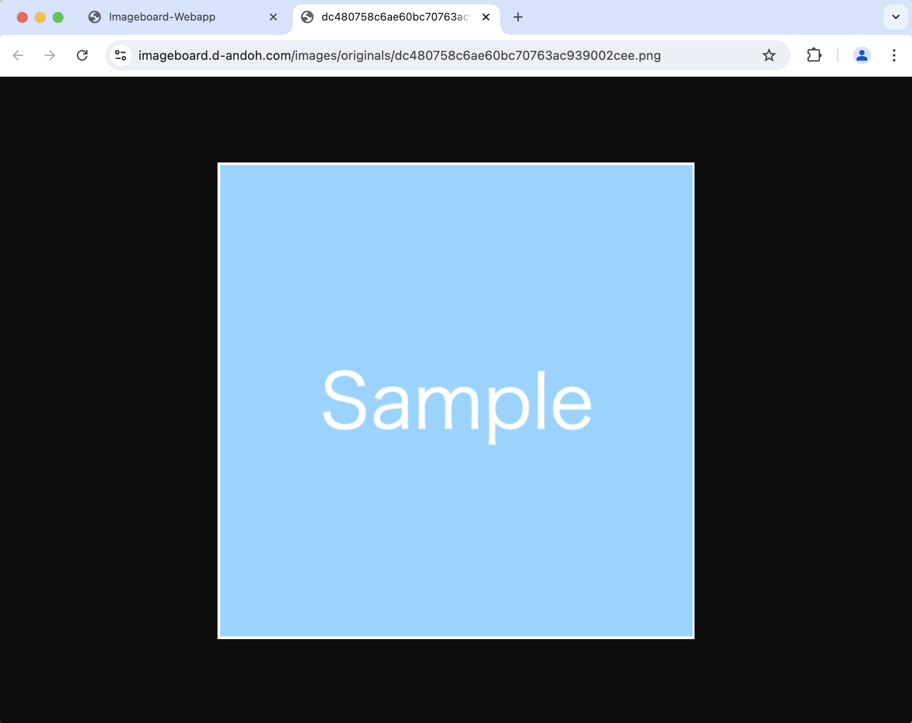

# imageboard-webapp


## URL

https://imageboard.d-andoh.com

## About

このアプリケーションは、スレッドベースのコミュニケーションサービスです。
ユーザー同士が画像やテキストコンテンツを通してやり取りすることができます。ユーザアカウントはなく、すべての投稿は匿名です。

ユーザーは、画像と共にコンテンツを投稿することで新しいスレッドを作成できます。メインスレッドが作成されると、他のユーザーはテキストや画像を使ってそれに返信できます。

## Usage

トップ画面にスレッドがタイムライン形式で表示されます。



ナビバー右上の「+ 新規スレッド」をクリックすると、新規スレッド作成モーダルが表示されます。このモーダル内フォームからスレッドを作成します。
スレッドには任意の画像ファイル（`png`, `jpeg(jpg)`, `gif`）を添付することができます。



スレッドの「スレッドを確認する」をクリックすると、そのスレッドの詳細画面に遷移します。この画面では、スレッドとそのスレッドに対するリプライが表示されます。



リプライ一覧の下には、リプライボタンがあります。
このボタンをクリックすることでリプライモーダルが開き、リプライを作成することができます。



各投稿（スレッド, リプライ）の画像をクリックすると、その画像が別タブで開きます。



## Development

### Set Up

1. 環境変数設定

`.env.template` から `.env` を作成し、環境変数値を設定します。

```
$ cp .env.template .env
```

2. ライブラリ、DB初期化

```
$ composer install
$ php console migrate -i
```

3. ローカルサーバー起動

```
$ php -S localhost:8000 -t Public
```

### Database Migration

1. マイグレーションファイル生成

以下のコマンドを実行すると、`Database/Migrations/yyyy-mm-dd_[unix_timestamp]_[file_name].php` というマイグレーションファイルが生成されます。

```
$ php console code-gen migration --name [file_name]
```

マイグレーションファイルの `up` にマイグレーションロジック、`down` にロールバックロジックを記述します。

```php: Database/Migrations/yyyy-mm-dd_[unix_timestamp]_[file_name].php
<?php

namespace Database\Migrations;

use Database\Migrator\SchemaMigration;

class CreateSampleTeble implements SchemaMigration {
    public function up(): array {
        // マイグレーションロジックをここに追加
        return [];
    }

    public function down(): array {
        // ロールバックロジックを追加
        return [];
    }
}
```

2. マイグレーション実行

```
$ php console migrate
```

3. ロールバック実行

ロールバック時は、`--rollback`（`-r`）オプションを使用します。

```
$ php console migrate --rollback
or
$ php console migrate -r
```

また、ロールバックオプションに続けて整数値を設定すると、その回数分ロールバックを実行します。

```
# 現在のバージョンから2回分ロールバックする
$ php console migrate -r 2
```

### Database Seed

1. シードファイル生成

以下のコマンドを実行すると、`Database/Seeds/[file_name].php` というシードファイルが生成されます。

```
$ php console code-gen seeder --name [file_name]
```

シードファイルの `tableName` にシードデータを挿入するテーブル、`tableColumns` にそのテーブルのカラム名とデータ型, `createRowData` に実際に挿入するデータを定義します。

```php: Database/Migrations/yyyy-mm-dd_[unix_timestamp]_[file_name].php
<?php

namespace Database\Seeds;

use Faker\Factory;
use Database\AbstractSeeder;

class SampleSeeder extends AbstractSeeder {
    // TODO: tableName文字列の割り当て
    protected ?string $tableName = null;

    // TODO: tableColumns配列の割り当て
    protected array $tableColumns = [];

    public function createRowData(array $imageHashList): array {
        // TODO: createRowData()メソッドの実装
        return [];
    }
}
```

2. シード実行

シードコマンドを実行すると、`Database/Seeds/` のシードファイルが順に実行され、シードデータが登録されます。

```
$ php console seed
```

### Architecture

主要なディレクトリとファイルの一覧と簡単な説明は以下です。

```
imageboard-webapp/
├ Commands // consoleから実行されるコマンドラインプログラム関連
├ Constracts // 各種定数
├ Database // データベース関連
├ Docs // ドキュメント関連, アプリケーションに関係なし
├ Exceptions // 例外
├ Helpers // ヘルパー
├ Models // モデルオブジェクト
├ Public // 公開ファイル, この中の index.php がアプリケーションのエントリーポイント
├ Response // レスポンスデータを管理するオブジェクト
├ Routing // エンドポイントとその処理をまとめたルーティングファイル
├ Views // UI画面
└ console // コマンド実行のエントリーポイント
```

アプリケーションとしては、`Public/index.php` がエントリーポイントとなります。
`Public/index.php` は、`Routing/routes.php` を用いて、アクセスに応じた処理を実行します。
`Routing/routes.php` では、データベースへのアクセスが必要であればDAOを用いて、必要な処理を実行します。
そして、JSONもしくはHTMLレスポンスオブジェクトを返します。HTMLレスポンスの場合は、画面表示するViewファイルを紐付けます。

これは MVC に沿った設計です。
`Routing/routes.php` がController、`Views/*` がView、DAOを含むモデルオブジェクトがModelに該当します。

また、データベースマイグレーション等のコマンドラインプログラムは `console` がエントリーポイントとなります。`console` は引数に与えられた値に対応したコマンドラインプログラム（`Commands/Programs/*`）を実行します。

### Routes

このアプリケーションはCSRを採用しています。
`/` や `/thread/[id]` などの `/api` で始まらないルートはViewファイルを返すのみです。
そして、`/api` で始まるルートはAPIのエンドポイントとなります。

つまり、前者のルートで静的なViewファイルのみを返し、そのViewファイルが後者のAPIエンドポイントに適宜アクセスしてページをレンダリングします。

| ルート | 説明 |
|-----------|-----------|
| / | トップページに表示するタイムラインのViewファイルを返す |
| /api/get_all_threads | タイムラインに表示するスレッドデータを返す |
| /api/create_thread | スレッドを作成する |
| /thread/[id] | スレッドを表示するViewファイルを返す |
| /api/get_thread/[id] | [id]に対応するスレッドデータを返す |
| /api/get_replies/[id] | [id]に対応するスレッドのリプライデータを返す |
| /api/create_reply | リプライを作成する |
